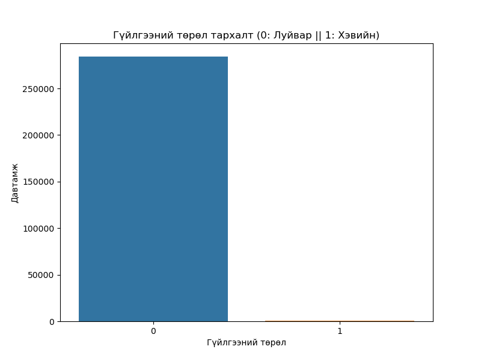
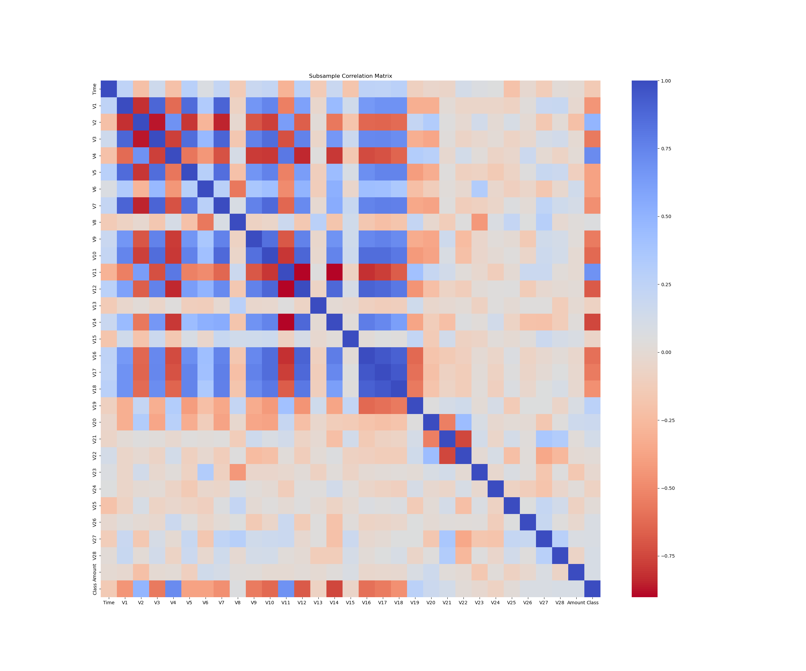
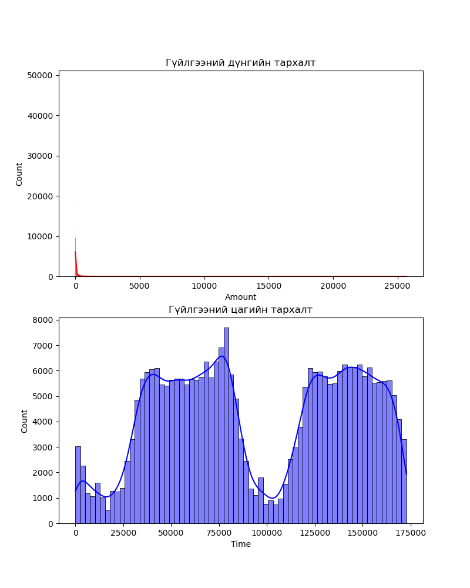
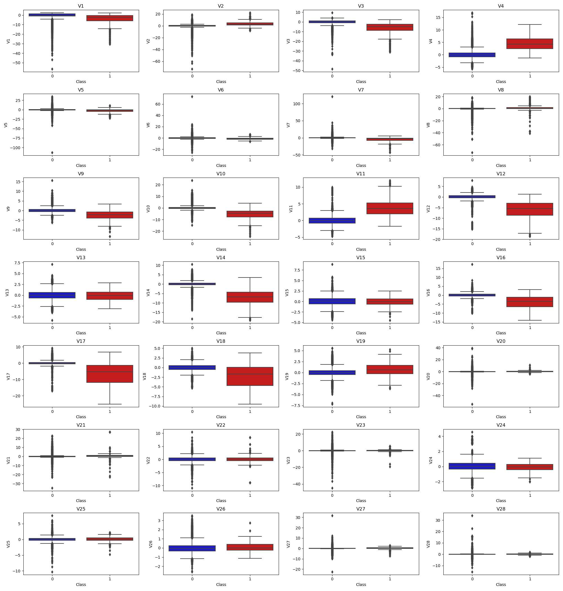

# Картын гүйлгээний луйврыг илрүүлэх

## 1. Ерөнхий тайлбар

## 1.1 Зорилго

Энэхүү шинжилгээний гол зорилго нь кредит картын луйврын гүйлгээг автоматаар илрүүлж, хамгийн оновчтой аргыг тодорхойлох юм. Хэд хэдэн хиймэл оюуны загвар болон сургалтын стратегийг туршиж, тэдгээрийн үр дүнг зөвхөн техникийн хэмжүүрээр бус, бодит **ашигт ажиллагаа** болон **хэрэглэгчийн сэтгэл ханамжид** хэрхэн нөлөөлөхөөр нь үнэллээ.

## 1.2 Өгөгдөл

Судалгааны өгөгдөл нь 2013 оны 9-р сард Европын карт эзэмшигчдийн хоёр өдрийн турш хийсэн гүйлгээнүүдээс бүрдсэн бөгөөд нууцлалыг хангахын тулд Principal Component Analysis (PCA) аргаар боловсруулалт хийгдсэн байсан.

* **Оролтууд:**
  * **V1–V28**: PCA-аас гарсан үндсэн бүрэлдэхүүнүүд
  * **Цаг (Time)**: тухайн гүйлгээ болон өгөгдлийн багц дахь анхны гүйлгээний хооронд өнгөрсөн секунд.
  * **Дүн (Amount)**: Гүйлгээний мөнгөн дүн.

* **Зорилтот хувьсагч:**
   * **Ангилал (Class)**: Хоёр төрөлтэй бөгөөд `1` нь залилангийн гүйлгээг, `0` нь хэвийн гүйлгээг илэрхийлнэ.

Гол бэрхшээл нь ангиллын тэнцвэргүй байдал бөгөөд луйврын гүйлгээ нь нийт 284,807 гүйлгээний дөнгөж **0.172%**-ийг эзэлж байна. Тэнцвэргүй байдлыг зохицуулах гурван үндсэн стратегийг харьцуулсан: **Анхны тэнцвэргүй өгөгдөл дээр сургах (суурь загвар)**, **Random Undersampling** ба **SMOTE (Synthetic Minority Over-sampling Technique)**. Стратеги тус бүрийн хувьд Logistic Regression, Random Forest, XGBoost, LightGBM зэрэг хэд хэдэн загваруудын гүйцэтгэлийг харьцуулан үнэлэв.

## 2. Өгөгдлийн тандалтын шинжилгээ (EDA)

### 2.1 Ангилал тархалт

Доор харуулснаар луйврын гүйлгээний (1) тоо нь хэвийн гүйлгээтэй (0) харьцуулахад маш өчүүхэн байна. Энэхүү тэнцвэргүй байдал нь үргэлж "Хэвийн" гэж таамагладаг модел 99.8%-иас дээш нарийвчлалтай (accuracy) ажиллана гэсэн үг бөгөөд энэ нь accuracy-г энэ тохиолдолд муу хэмжүүр болгож байна.

### 2.2 Хувьсагчдын уялдаа хамаарал

Эхний тэнцвэргүй өгөгдөл дээр PCA-ээр хувиргасан хувьсагчид болон Class хувьсагчийн хоорондын уялдаа сул, тодорхой бус байсан. Харин санамсаргүй undersampling хийж тэнцвэртэй өгөгдөл үүсгэсний дараа илүү тодорхой зураглал гарч ирсэн.

* **Хүчтэй сөрөг хамаарал:** V12, V14, V17 хувьсагчид. Эдгээрийн бага утга нь луйврын магадлал өндөр байгаатай хүчтэй холбоотой.

* **Хүчтэй эерэг хамаарал:** V4 болон V11 хувьсагчид. Өндөр утгууд нь луйврын гүйлгээтэй эерэгээр уялдсан байна.

### 2.3 Time болон Amount-ийн тархалт

`Time` болон `Amount` хувьсагчид нь бусад шиг масштаблагдаагүй байсан

### 2.4 PCA тархалт

PCA-гаар хувиргасан ихэнх хувьсагчид (V1–V28) хэвийн гүйлгээний хувьд тэгийн ойролцоо төвлөрсөн, хэвийн тархалттай төстэй хэлбэртэй байсан. Харин луйврын гүйлгээний тархалт нь илүү өөр, хазайлттай, дундаж утга нь өөрчлөгдсөн байв. Ялангуяа V4, V11, V14, V16 хувьсагчид нь хоёр ангиллын хооронд хамгийн их ялгарал үзүүлсэн.

## 3. Арга зүй

### 3.1 Урьдчилсан боловсруулалт

* **Хувьсагчийн масштабчлал (Feature Scaling)**: `Amount` ба `Time` хувьсагчдыг `RobustScaler` ашиглан масштабчилсан бөгөөд энэ нь `StandardScaler`-аас илүүтэйгээр хэвийн бус утгуудад мэдрэмж багатай байдаг.
* **Сургалтын-Тестийн хуваалт (Train-Test Split)**: Анхны ангиллын тархалтыг нь хадгалахын тулд өгөгдлийг stratification аргаар сургалтын (80%) ба тестийн (20%) багц болгон хуваасан.

### 3.2 Ангиллын тэнцвэргүй байдлыг зохицуулах

Машин сургалтын загвараа "сургах"-ын тулд гурван өөр аргыг ашигласан:

1.  **"Байгаагаар нь" сургах арга (Анхны өгөгдөл):** Бодит өгөгдлийг ямар ч өөрчлөлтгүйгээр шууд ашиглан сургалт явуулсан. Энэ нь ямар нэгэн тусгай арга хэрэглэхгүйгээр систем хэр сайн ажиллахыг харах суурь түвшин юм.

2.  **Undersampling:** Луйврын гүйлгээ маш цөөхөн байсан тул хэвийн гүйлгээний тоог эрс цөөрүүлж, луйврын гүйлгээний тоотой тэнцүү хэмжээнд аваачиж, тэнцвэртэй өгөгдөл үүсгэсэн. Энэ аргын гол эрсдэл нь системд хэтэрхий цөөн жишээн дээр суралцаж, бодит байдлын талаар өрөөсгөл ойлголттой болох явдал юм.

3.  **"Луйврыг дуурайлган үүсгэх" арга (SMOTE):** Луйврын гүйлгээний жишээ тоо хангалтгүй байсан тул одоо байгаа луйврын гүйлгээнүүд дээр тулгуурлан бодит мэт харагдах олон мянган "хиймэл" луйврын гүйлгээг системдээ үүсгэж өгсөн. Энэ нь системийг илүү олон жишээн дээр "дадлагажуулж", луйврыг таних чадварыг нь сайжруулах зорилготой.

### 3.3 Загвар сургах ба үнэлгээ

Стратеги тус бүрээр боловсруулсан өгөгдөл дээр дараах загваруудыг сургасан:
- Logistic Regression
- Random Forest
- XGBoost
- LightGBM

Загварын гүйцэтгэлийг үнэлэхдээ бизнесийн удирдлагын хувьд ойлгомжтой, бодит үр дүнд чиглэсэн хэд хэдэн хэмжүүрийг ашигласан:

* **Оновчтой байдал (Precision):** "'Луйвар' гэж таамагласан гүйлгээ бодитоор хэр олон хувь нь луйвар байсан бэ?" Энэ үзүүлэлт өндөр байх нь хэрэглэгчдийн хэвийн гүйлгээг хаагаагүй, тэдэнд төвөг учруулаагүй гэсэн үг юм.

* **Луйврыг илрүүлэх хувь (Recall):** "Нийт гарсан луйврын гүйлгээний хэдэн хувийг нь амжилттай 'барьж' чадсан бэ?" Энэ нь хэр их мөнгийг луйварчдад алдахаас сэргийлж чадсаныг харуулна.

* **Ерөнхий гүйцэтгэл (F1-Score):** Дээрх хоёр хэмжүүрийн тэнцвэрийг харуулсан нэгдсэн оноо. Оновчтой байдал болон илрүүлэх хувь хоёулаа сайн байвал энэ оноо өндөр гарна. Энэ нь загварын ерөнхий найдвартай байдлыг илтгэнэ.

* **Загварын ерөнхий чадамж (PR-AUC):** Энэ бол 0-ээс 1 хооронд хэмжигддэг нэгдсэн оноо бөгөөд загвар нь "Оновчтой байдал" болон "Илрүүлэх хувь" хоёрыг хэр сайн тэнцвэржүүлж чадаж байгааг харуулдаг. Энэ оноо 1-д ойртох тусам загвар нь луйврыг илрүүлэхдээ маш сайн атлаа хэвийн гүйлгээг бага алдаатай таньдаг гэсэн үг юм.

* **Ашиг (Profit):** Энэ бол бизнесын хувьд хамгийн чухал хэмжүүр юм. Загвар бүрийн санхүүгийн үр нөлөөг тооцоолсон. Үүнд: хэвийн гүйлгээнээс олсон шимтгэлийн орлого, илрүүлж чадаагүй луйврын гүйлгээнээс үүссэн алдагдал зэргийн зөрүүг тооцож гаргасан.

## 4. Үр дүн

Шинжилгээний үр дүнг нэгтгэн доорх хүснэгтэд харуулав. Энд луйврын ангиллын (`Class=1`) precision, recall, f1-score-г харуулсан болно.

| Стратеги | Загвар | Оновчтой байдал (Луйвар) | Луйврыг илрүүлэх хувь (Луйвар) | Ерөнхий гүйцэтгэл (F1-Score) | AUC-PR | Ашиг |
| :--- | :--- | :--- | :--- | :--- | :--- | :--- |
| **Анхны өгөгдөл** | Logistic Regression | 0.83 | 0.64 | 0.72 | 0.7444 | $95,071.64 |
| | **Random Forest** | **0.94** | **0.82** | **0.87** | **0.8647** | **$99,033.33** |
| | XGBoost | 0.92 | 0.81 | 0.86 | 0.8776 | $98,448.31 |
| | LightGBM | 0.31 | 0.52 | 0.39 | 0.3629 | $94,500.54 |
| --- | --- | --- | --- | --- | --- | --- |
| **Undersampling** | Logistic Regression | 0.04 | 0.92 | 0.07 | 0.6853 | $89,058.45 |
| | Random Forest | 0.04 | 0.92 | 0.08 | 0.7541 | $88,714.43 |
| | **XGBoost** | **0.03** | **0.92** | **0.06** | **0.4046** | **$91,880.01** |
| | LightGBM | 0.03 | 0.92 | 0.07 | 0.6269 | $91,603.00 |
| --- | --- | --- | --- | --- | --- | --- |
| **SMOTE** | Logistic Regression | 0.06 | 0.92 | 0.11 | 0.7704 | $93,710.94 |
| | Random Forest | 0.88 | 0.82 | 0.85 | 0.8705 | $97,127.03 |
| | XGBoost | 0.72 | 0.86 | 0.78 | 0.8672 | $97,407.07 |
| | **LightGBM** | 0.53 | 0.88 | 0.66 | 0.8441 | **$99,129.46** |

### 4.1. Анхны тэнцвэргүй өгөгдөл (Суурь загвар)

* **Гол ололт:** **Random Forest** загвар энэ аргачлал дундаас хамгийн шилдэг нь байлаа.
    * **Оновчтой байдал (Precision): 0.94** – Энэ нь систем "луйвар" гэж таамагласан 100 гүйлгээний 94 нь үнэхээр луйвар байсан гэсэн үг. Энэ нь маш өндөр үзүүлэлт бөгөөд бид хэвийн гүйлгээ хийж буй хэрэглэгчдэдээ бараг төвөг учруулаагүйг харуулж байна.
    * **Илрүүлэлт (Recall): 0.82** – Нийт гарсан бодит луйврын 82%-ийг амжилттай илрүүлж чадсан. Өөрөөр хэлбэл, 100 луйврын гүйлгээ тутмын 82-ыг нь зогсоож, компанид учирч болох байсан санхүүгийн алдагдлаас сэргийлж чаджээ.

* **Бизнесийн үр дүн:** Энэ загвар нь оновчтой байдал ба илрүүлэлтийн хооронд маш сайн тэнцвэрийг хангаж (F1-Score: 0.87), нийт **$99,033.33**-н ашиг авчирсан. Энэ нь ямар нэгэн нэмэлт өгөгдөл боловсруулалтгүйгээр ч найдвартай загвар сургах боломжтойг харуулж байна.

### 4.2. Undersampling

* **Гол ололт:** Бүх загварууд дунд нийт луйврын гүйлгээний **92%**-ийг олж илрүүлсэн нь сайн сонсогдож магадгүй.
    * **Ноцтой сул тал (Precision): 3-4%** – Гэвч "луйвар" гэж таньсан 100 гүйлгээний ердөө 3-4 нь л үнэхээр луйвар байв. Үлдсэн 96-97 гүйлгээ нь хэрэглэгчдийн хэвийн гүйлгээ байсан гэсэн үг.

* **Бизнесийн үр дүн:** Энэ загварыг ашиглавал олон мянган хэрэглэгчийн гүйлгээг шалтгаангүйгээр зогсоож, тэднийг бухимдуулж, сөргөөр нөлөөлөх эрсдэлийг бий болгоно гэсэн үг. Тиймээс энэ арга нь бодит хэрэглээнд тохиромжгүй юм.

### 4.3. SMOTE

* **Гол ололт:** Энэ арга нь ашиг олох болон найдвартай ажиллагааг тэнцвэржүүлэх хоёр өөр боломжийг харуулж байна.
    * **Хамгийн өндөр ашиг (LightGBM):** Энэ аргыг ашиглахад **LightGBM** загвар нь туршилтын хугацаанд хамгийн өндөр буюу **$99,129.46**-н ашиг авчирсан. Гэхдээ энэ ашгийг олохын тулд бага зэргийн эрсдэл хүлээсэн. Тухайлбал, 'луйвар' гэж таамаглахдаа хааяа алдаа гаргах магадлал нь (Precision 0.53) анхны загвараас арай өндөр байв. Өөрөөр хэлбэл, ашгийг нэмэгдүүлэхийн тулд хэвийн гүйлгээг алдаатай хаах эрсдэлийг бага зэрэг нэмэгдүүлсэн гэсэн үг.

* **Бизнесийн үр дүн:** SMOTE арга нь системийг луйврын гүйлгээний олон жишээн дээр "дадлагажуулснаар" нийт гүйцэтгэлийг сайжруулах, ашгийг нэмэгдүүлэх боломжтойг харууллаа.

## 5. Дүгнэлт

Энэхүү шинжилгээний үр дүнгээс хэд хэдэн чухал дүгнэлт гарч байна:

* **Хамгийн өндөр ашигтай загвар:** SMOTE аргачлалаар сургасан **LightGBM загвар** нь хамгийн өндөр буюу **$99,129.46**-н ашиг авчирсан. Энэ нь санхүүгийн хувьд хамгийн үр өгөөжтэй сонголт юм.

* **Хамгийн найдвартай загвар:** Ямар нэгэн тусгай арга хэмжээ авалгүй, **анхны өгөгдөл дээр сургасан Random Forest загвар** нь луйврын гүйлгээг илрүүлэхдээ хамгийн өндөр нарийвчлалтай (алдаа багатай) байж, ашгийн хэмжээгээрээ бараг ижил түвшинд (**$99,033.33**) очсон. Энэ загвар нь хэрэглэгчдийн хэвийн гүйлгээг алдаатай хаах эрсдэл хамгийн багатай юм.

* **Зөвлөмж:** Хэрэв бизнесийн нэн тэргүүний зорилт нь ашгийг тултал нь нэмэгдүүлэхээс илүүтэйгээр хэрэглэгчийн сэтгэл ханамжийг дээд зэргээр хангах, тэдний гүйлгээг алдаатай хаах эрсдэлийг хамгийн бага байлгах хэрэгтэй бол анхны өгөгдөл дээр сургасан Random Forest загвар нь найдвартай хувилбар юм. Энэ загвар нь ердөө $100 орчмоор бага ашигтай ч, луйврыг таамаглахдаа илүү оновчтой байсан.